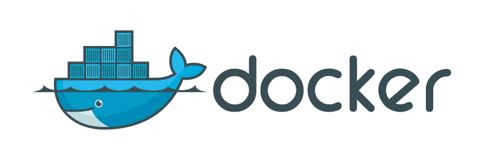

## Red Hat Patches
Red Hat is carrying a series of experimental patches that we feel are required
for our customers or for our support engineering.

#### BACKPORT:-Add-support-for-setting-sysctls.patch

https://github.com/docker/docker/pull/19265

#### BACKPORT:-Fix-compilation-errors-with-btrfs-progs-4.5.patch

https://github.com/docker/docker/pull/21723

#### BACKPORT:-Inherit-StopSignal-from-Dockerfile.patch

https://github.com/docker/docker/pull/20290

#### devmapper:-Add-a-new-option-dm.min_free_space.patch

https://github.com/docker/docker/pull/20786

#### Backport fixes around journald logging

https://bugzilla.redhat.com/show_bug.cgi?id=1314463

#### BACKPORT:-Set-Delegate=yes-for-cgroups-transient-units.patch

https://github.com/opencontainers/runc/pull/648

#### BACKPORT:-Move-prestart-hooks-after-container-mounts.patch

https://github.com/opencontainers/runc/pull/568

#### BACKPORT:-daemon_unix:-set-golang-runtime-max-threads.patch

https://github.com/docker/docker/pull/18362

#### BACKPORT:-Ensure-that-we-join-all-the-cgroups.patch

https://github.com/opencontainers/runc/pull/491

#### BACKPORT:-Mount-volumes-rprivate-for-archival-and-other-use-cases.patch

https://github.com/docker/docker/pull/22009

#### BACKPORT:-Make-overlay-home-dir-Private-Mount.patch

https://github.com/docker/docker/pull/22069

#### BACKPORT:-Properly-expand-systemd-slice-names.patch

https://github.com/opencontainers/runc/pull/511

#### Ignore-invalid-host-header-between-go1.6-and-old-docker-clients.patch

https://bugzilla.redhat.com/show_bug.cgi?id=1324150
https://github.com/docker/docker/pull/22000
https://github.com/docker/docker/issues/20865
https://github.com/docker/docker/pull/21423

#### The-following-syscalls-should-not-be-blocked-by-seccomp.patch

Capabilities block these syscalls.

mount, umount2, unshare, reboot and name\_to\_handle\_at are all needed to
run systemd as pid1 in a container, they work fine with sys\_admin disabled
and have functionality in the kernel that is available to a non privileged
process.  There is no easy way to discover which syscalls are blocked, so
we end up more likely with the user doing a --privileged.

With UserNamespace we want to allow users to potentially setup unshare additional
namespaces.

man reboot
...
Behavior inside PID namespaces
Since Linux 3.4, when reboot() is called from a PID namespace (see
		pid_namespaces(7)) other than the initial PID namespace, the effect
		of the call is to send a signal to the namespace "init" process.
		LINUX_REBOOT_CMD_RESTART and LINUX_REBOOT_CMD_RESTART2 cause a SIGHUP
		signal to be sent.  LINUX_REBOOT_CMD_POWER_OFF and
		LINUX_REBOOT_CMD_HALT cause a SIGINT signal to be sent.

https://github.com/docker/docker/pull/21287

#### Add-dockerhooks-exec-custom-hooks-for-prestart/poststop-containers.patch

With the addition of runc/hooks support we want to add a feature
to allow third parties to run helper programs before a docker container
gets started and just after the container finishes.

For example we want to add a RegisterMachine hook.

For systems that support systemd/RegisterMachine, this hook would register
a machine to the machinectl.  machinectl could then list docker containers
along with other virtulization environments like kvm, and systemd-nspawn
containers. Overtime we would want to implement other machinectl features
to get docker containers better integrated into the system and machinectl.

Another example of a dockerhook might be for people wanting to do better logging
of starting and stopping of containers.  For example have a log agent that
records when a container starts and stops and then sends a message to a
monitoring station.

Dockerhooks reads directory in either /usr/lib/docker/hooks.d or
/usr/libexec/docker/hooks.d to search for hooks, if the directory exists
docker will execute the executables in this directory via runc/libcontainer i
using PreStart and PostStop.  It will also send the config.json file as the
second paramater.

https://github.com/docker/docker/pull/17021

#### Return-rpm-version-of-packages-in-docker-version.patch

Red Hat Support wants to know the version of the rpm package that docker
is running.  This patch allows the distribution to show the rpm version
of the client and server using the `docker info` command.  Docker upstream
was not interested in this patch. This patch only affects the `docker info`
command.

https://github.com/docker/docker/pull/14591

#### rebase-distribution-specific-build.patch

Current docker tests run totally on Ubuntu.  We want to be able to make sure
all tests run on platforms and containers we support.  This patch allows us
to run distribution specific tests. This means that `make test` on RHEL7 will
use rhel7 based images for the test, and `make test` on Fedora will use
fedora based images for the test.  Docker was not crazy about the substitutions
done in this patch, and the changes never show up in the docker client/daemon
that we ship.

https://github.com/docker/docker/pull/15364

#### Add-RHEL-super-secrets-patch.patch

This patch allows us to provide subscription management information from the
host into containers for both `docker run` and `docker build`.  In order to get
access to RHEL7 and RHEL6 content inside of a container via yum you need to
use a subscription.  This patch allows the subscriptions to work inside of the
container.  Docker thought this was too RHEL specific so told us to carry a
patch.

https://github.com/docker/docker/pull/6075

#### Add-add-registry-and-block-registry-options-to-docke.patch

Customers have been asking for us to provide a mechanism to allow additional
registries to be specified in addition to docker.io.  We also want to have
Red Hat Content available from our Registry by default. This patch allows
users to customize the default registries available.  We believe this closely
aligns with the way yum and apt currently work.  This patch also allows
customers to block images from registries.  Some customers do not want software
to be accidentally pulled and run on a machine.  Some customers also have no
access to the internet and want to setup private registries to handle their
content.

https://github.com/docker/docker/pull/11991
https://github.com/docker/docker/pull/10411

#### Improved-searching-experience.patch

Red Hat wants to allow users to search multiple registries as described above.
This patch improves the search experience.

#### System-logging-for-docker-daemon-API-calls.patch
Red Hat wants to log all access to the docker daemon.  This patch records all
access to the docker daemon in syslog/journald.  Currently docker logs access
in its event logs but these logs are not stored permanently and do not record
critical information like loginuid to record which user created/started/stopped
... containers.  We will continue to work with Docker to get this patch
merged. Docker indicates that they want to wait until the authentication patches
get merged.

https://github.com/docker/docker/pull/14446

#### Audit-logging-support-for-daemon-API-calls.patch

This is a follow on patch to the previous syslog patch, to record all auditable
events to the audit log.  We want to get `docker daemon` to some level of common
criteria.  In order to do this administrator activity must be audited.

https://github.com/rhatdan/docker/pull/109

#### Add-volume-support-to-docker-build.patch

This patch adds the ability to add bind mounts at build-time. This will be
helpful in supporting builds with host files and secrets. The --volume|-v flag
is added for this purpose. Trying to define a volume (ala docker run) errors
out. Each bind mounts' mode will be read-only and it will preserve any SELinux
label which was defined via the cli (:[z,Z]). Defining a read-write mode (:rw)
will just print a warning in the build output and the actual mode will be
changed to read-only.

Docker: the container engine [](https://github.com/docker/docker/releases/latest)
============================

Docker is an open source project to pack, ship and run any application
as a lightweight container.

Docker containers are both *hardware-agnostic* and *platform-agnostic*.
This means they can run anywhere, from your laptop to the largest
cloud compute instance and everything in between - and they don't require
you to use a particular language, framework or packaging system. That
makes them great building blocks for deploying and scaling web apps,
databases, and backend services without depending on a particular stack
or provider.

Docker began as an open-source implementation of the deployment engine which
powers [dotCloud](https://www.dotcloud.com), a popular Platform-as-a-Service.
It benefits directly from the experience accumulated over several years
of large-scale operation and support of hundreds of thousands of
applications and databases.



## Security Disclosure

Security is very important to us. If you have any issue regarding security, 
please disclose the information responsibly by sending an email to 
security@docker.com and not by creating a github issue.

## Better than VMs

A common method for distributing applications and sandboxing their
execution is to use virtual machines, or VMs. Typical VM formats are
VMware's vmdk, Oracle VirtualBox's vdi, and Amazon EC2's ami. In theory
these formats should allow every developer to automatically package
their application into a "machine" for easy distribution and deployment.
In practice, that almost never happens, for a few reasons:

  * *Size*: VMs are very large which makes them impractical to store
     and transfer.
  * *Performance*: running VMs consumes significant CPU and memory,
    which makes them impractical in many scenarios, for example local
    development of multi-tier applications, and large-scale deployment
    of cpu and memory-intensive applications on large numbers of
    machines.
  * *Portability*: competing VM environments don't play well with each
     other. Although conversion tools do exist, they are limited and
     add even more overhead.
  * *Hardware-centric*: VMs were designed with machine operators in
    mind, not software developers. As a result, they offer very
    limited tooling for what developers need most: building, testing
    and running their software. For example, VMs offer no facilities
    for application versioning, monitoring, configuration, logging or
    service discovery.

By contrast, Docker relies on a different sandboxing method known as
*containerization*. Unlike traditional virtualization, containerization
takes place at the kernel level. Most modern operating system kernels
now support the primitives necessary for containerization, including
Linux with [openvz](https://openvz.org),
[vserver](http://linux-vserver.org) and more recently
[lxc](https://linuxcontainers.org/), Solaris with
[zones](https://docs.oracle.com/cd/E26502_01/html/E29024/preface-1.html#scrolltoc),
and FreeBSD with
[Jails](https://www.freebsd.org/doc/handbook/jails.html).

Docker builds on top of these low-level primitives to offer developers a
portable format and runtime environment that solves all four problems.
Docker containers are small (and their transfer can be optimized with
layers), they have basically zero memory and cpu overhead, they are
completely portable, and are designed from the ground up with an
application-centric design.

Perhaps best of all, because Docker operates at the OS level, it can still be
run inside a VM!

## Plays well with others

Docker does not require you to buy into a particular programming
language, framework, packaging system, or configuration language.

Is your application a Unix process? Does it use files, tcp connections,
environment variables, standard Unix streams and command-line arguments
as inputs and outputs? Then Docker can run it.

Can your application's build be expressed as a sequence of such
commands? Then Docker can build it.

## Escape dependency hell

A common problem for developers is the difficulty of managing all
their application's dependencies in a simple and automated way.

This is usually difficult for several reasons:

  * *Cross-platform dependencies*. Modern applications often depend on
    a combination of system libraries and binaries, language-specific
    packages, framework-specific modules, internal components
    developed for another project, etc. These dependencies live in
    different "worlds" and require different tools - these tools
    typically don't work well with each other, requiring awkward
    custom integrations.

  * *Conflicting dependencies*. Different applications may depend on
    different versions of the same dependency. Packaging tools handle
    these situations with various degrees of ease - but they all
    handle them in different and incompatible ways, which again forces
    the developer to do extra work.

  * *Custom dependencies*. A developer may need to prepare a custom
    version of their application's dependency. Some packaging systems
    can handle custom versions of a dependency, others can't - and all
    of them handle it differently.


Docker solves the problem of dependency hell by giving the developer a simple
way to express *all* their application's dependencies in one place, while
streamlining the process of assembling them. If this makes you think of
[XKCD 927](https://xkcd.com/927/), don't worry. Docker doesn't
*replace* your favorite packaging systems. It simply orchestrates
their use in a simple and repeatable way. How does it do that? With
layers.

Docker defines a build as running a sequence of Unix commands, one
after the other, in the same container. Build commands modify the
contents of the container (usually by installing new files on the
filesystem), the next command modifies it some more, etc. Since each
build command inherits the result of the previous commands, the
*order* in which the commands are executed expresses *dependencies*.

Here's a typical Docker build process:

```bash
FROM ubuntu:12.04
RUN apt-get update && apt-get install -y python python-pip curl
RUN curl -sSL https://github.com/shykes/helloflask/archive/master.tar.gz | tar -xzv
RUN cd helloflask-master && pip install -r requirements.txt
```

Note that Docker doesn't care *how* dependencies are built - as long
as they can be built by running a Unix command in a container.


Getting started
===============

Docker can be installed either on your computer for building applications or
on servers for running them. To get started, [check out the installation
instructions in the
documentation](https://docs.docker.com/engine/installation/).

We also offer an [interactive tutorial](https://www.docker.com/tryit/)
for quickly learning the basics of using Docker.

Usage examples
==============

Docker can be used to run short-lived commands, long-running daemons
(app servers, databases, etc.), interactive shell sessions, etc.

You can find a [list of real-world
examples](https://docs.docker.com/engine/examples/) in the
documentation.

Under the hood
--------------

Under the hood, Docker is built on the following components:

* The
  [cgroups](https://www.kernel.org/doc/Documentation/cgroup-v1/cgroups.txt)
  and
  [namespaces](http://man7.org/linux/man-pages/man7/namespaces.7.html)
  capabilities of the Linux kernel
* The [Go](https://golang.org) programming language
* The [Docker Image Specification](https://github.com/docker/docker/blob/master/image/spec/v1.md)
* The [Libcontainer Specification](https://github.com/opencontainers/runc/blob/master/libcontainer/SPEC.md)

Contributing to Docker [](https://godoc.org/github.com/docker/docker)
======================

| **Master** (Linux) | **Experimental** (linux) | **Windows** | **FreeBSD** |
|------------------|----------------------|---------|---------|
| [](https://jenkins.dockerproject.org/view/Docker/job/Docker%20Master/) | [](https://jenkins.dockerproject.org/view/Docker/job/Docker%20Master%20%28experimental%29/) | [/badge/icon)](http://jenkins.dockerproject.org/job/Docker%20Master%20(windows)/) | [/badge/icon)](http://jenkins.dockerproject.org/job/Docker%20Master%20(freebsd)/) |

Want to hack on Docker? Awesome! We have [instructions to help you get
started contributing code or documentation](https://docs.docker.com/opensource/project/who-written-for/).

These instructions are probably not perfect, please let us know if anything
feels wrong or incomplete. Better yet, submit a PR and improve them yourself.

Getting the development builds
==============================

Want to run Docker from a master build? You can download 
master builds at [master.dockerproject.org](https://master.dockerproject.org). 
They are updated with each commit merged into the master branch.

Don't know how to use that super cool new feature in the master build? Check
out the master docs at
[docs.master.dockerproject.org](http://docs.master.dockerproject.org).

How the project is run
======================

Docker is a very, very active project. If you want to learn more about how it is run,
or want to get more involved, the best place to start is [the project directory](https://github.com/docker/docker/tree/master/project).

We are always open to suggestions on process improvements, and are always looking for more maintainers.

### Talking to other Docker users and contributors

<table class="tg">
  <col width="45%">
  <col width="65%">
  <tr>
    <td>Internet&nbsp;Relay&nbsp;Chat&nbsp;(IRC)</td>
    <td>
      <p>
        IRC is a direct line to our most knowledgeable Docker users; we have
        both the  <code>#docker</code> and <code>#docker-dev</code> group on
        <strong>irc.freenode.net</strong>.
        IRC is a rich chat protocol but it can overwhelm new users. You can search
        <a href="https://botbot.me/freenode/docker/#" target="_blank">our chat archives</a>.
      </p>
      Read our <a href="https://docs.docker.com/project/get-help/#irc-quickstart" target="_blank">IRC quickstart guide</a> for an easy way to get started.
    </td>
  </tr>
  <tr>
    <td>Google Groups</td>
    <td>
      There are two groups.
      <a href="https://groups.google.com/forum/#!forum/docker-user" target="_blank">Docker-user</a>
      is for people using Docker containers.
      The <a href="https://groups.google.com/forum/#!forum/docker-dev" target="_blank">docker-dev</a>
      group is for contributors and other people contributing to the Docker
      project.
      You can join them without an google account by sending an email to e.g. "docker-user+subscribe@googlegroups.com".
      After receiving the join-request message, you can simply reply to that to confirm the subscribtion.
    </td>
  </tr>
  <tr>
    <td>Twitter</td>
    <td>
      You can follow <a href="https://twitter.com/docker/" target="_blank">Docker's Twitter feed</a>
      to get updates on our products. You can also tweet us questions or just
      share blogs or stories.
    </td>
  </tr>
  <tr>
    <td>Stack Overflow</td>
    <td>
      Stack Overflow has over 7000 Docker questions listed. We regularly
      monitor <a href="https://stackoverflow.com/search?tab=newest&q=docker" target="_blank">Docker questions</a>
      and so do many other knowledgeable Docker users.
    </td>
  </tr>
</table>

### Legal

*Brought to you courtesy of our legal counsel. For more context,
please see the [NOTICE](https://github.com/docker/docker/blob/master/NOTICE) document in this repo.*

Use and transfer of Docker may be subject to certain restrictions by the
United States and other governments.

It is your responsibility to ensure that your use and/or transfer does not
violate applicable laws.

For more information, please see https://www.bis.doc.gov


Licensing
=========
Docker is licensed under the Apache License, Version 2.0. See
[LICENSE](https://github.com/docker/docker/blob/master/LICENSE) for the full
license text.

Other Docker Related Projects
=============================
There are a number of projects under development that are based on Docker's
core technology. These projects expand the tooling built around the
Docker platform to broaden its application and utility.

* [Docker Registry](https://github.com/docker/distribution): Registry 
server for Docker (hosting/delivery of repositories and images)
* [Docker Machine](https://github.com/docker/machine): Machine management 
for a container-centric world
* [Docker Swarm](https://github.com/docker/swarm): A Docker-native clustering 
system
* [Docker Compose](https://github.com/docker/compose) (formerly Fig): 
Define and run multi-container apps
* [Kitematic](https://github.com/docker/kitematic): The easiest way to use 
Docker on Mac and Windows

If you know of another project underway that should be listed here, please help 
us keep this list up-to-date by submitting a PR.

Awesome-Docker
==============
You can find more projects, tools and articles related to Docker on the [awesome-docker list](https://github.com/veggiemonk/awesome-docker). Add your project there.
